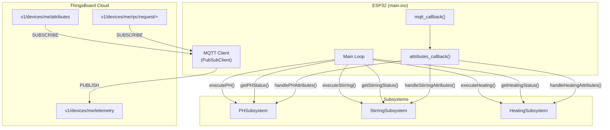

# Bioreactor Control System

This project implements a bioreactor control system using an ESP32, managing pH, stirring (RPM), and temperature. It integrates with **ThingsBoard** via MQTT for telemetry, remote control (RPC), and configuration (Shared Attributes).

## System Architecture

The system is designed with a modular architecture. The main application (`main.ino`) orchestrates multiple independent **subsystems**.

### Core Components

- **Main Controller (`main.ino`)**: Handles WiFi/MQTT connections, orchestrates subsystem execution, and manages the global telemetry loop.
- **Subsystems**: Independent modules for each physical parameter (pH, Stirring, Heating). Each subsystem encapsulates its own hardware setup, control logic, and data handling.

### Hardware

- **Microcontroller**: ESP32
- **Sensors**:
  - pH Sensor (Analog)
  - Thermistor (Analog)
  - Hall Effect Sensor (RPM measurement)
- **Actuators**:
  - Peristaltic Pumps (Acid/Base)
  - DC Motor (Stirring)
  - Heating Element (PWM controlled)

---

## Data Pipeline

The system uses **MQTT** to communicate with ThingsBoard.

### 1. Telemetry (Device -> Cloud)

- **Topic**: `v1/devices/me/telemetry`
- **Frequency**: Every 5 seconds (default)

The main loop aggregates status from all subsystems into a single JSON payload.

**JSON Payload Structure:**

```json
{
  // pH Subsystem
  "pH": 7.0, // (Note: Key inferred, verify implementation)
  "acid_state": false, // (Note: Key inferred)
  "base_state": false, // (Note: Key inferred)
  "target_pH": 7.0,

  // Stirring Subsystem
  "rpm_measured": 500,
  "rpm_set": 500,

  // Heating Subsystem
  "temperature": 37.0,
  "heater_state": true,
  "target_temperature": 37.0,

  // Global Status
  "operational_mode": true // true = Active, false = Inactive
}
}
```

### 2. Shared Attributes (Cloud -> Device)

**Topic**: `v1/devices/me/attributes`

Configuration parameters are managed via ThingsBoard Shared Attributes. The device subscribes to updates and applies them in real-time.

**Supported Attributes:**

| Attribute Key | Type | Description | Subsystem |
| :--- | :--- | :--- | :--- |
| `target_pH` | float | Target pH value (e.g., 7.0) | pH |
| `pH_tolerance` | float | Hysteresis range for pH control (e.g., 0.1) | pH |
| `target_rpm` | int | Target Stirring Speed (500-1500 RPM) | Stirring |
| `target_temperature` | float | Target Temperature in Celsius (e.g., 37.0) | Heating |
| `temp_tolerance` | float | Hysteresis range for temperature control | Heating |
| `operational_mode` | boolean | Master Switch (true = ON, false = OFF) | Global |

### 3. RPC Commands (Cloud -> Device)

**Topic**: `v1/devices/me/rpc/request/+`

Remote Procedure Calls (RPC) are used for immediate actions or manual overrides.

**Supported Methods:**

**`setPump`** (Manual Pump Control)

- **Params**: `{"pump": "acid" | "base", "duration": 1000}`
- **Description**: Pulses the specified pump for `duration` milliseconds.

---

## Subsystem Connectivity

This section describes how the main controller (`main.ino`) connects with and orchestrates the subsystems (pH, Stirring, Heating).

### Architecture Overview



### Subsystem Interface Contract

Each subsystem exposes a standard set of functions that `main.ino` calls:

| Function | Purpose | Called From |
| :--- | :--- | :--- |
| `setup[Subsystem]()` | Initialize hardware pins and sensors | `setup()` |
| `execute[Subsystem]()` | Run control loop logic (non-blocking) | `loop()` |
| `get[Subsystem]Status(JsonObject&)` | Populate telemetry payload | Telemetry publish block |
| `handle[Subsystem]Attributes(JsonObject&)` | Process attribute updates | `attributes_callback()` |
| `handle[Subsystem]Command(...)` | Process RPC commands (optional) | `mqtt_callback()` |

### Telemetry Publishing Flow (Device → Cloud)

Every 5 seconds (`PUBLISH_INTERVAL`), the main loop aggregates data from all subsystems:

```text
1. main.ino creates a JsonObject (root)
2. Calls getPHStatus(root)     → Adds: pH, target_pH, acid_pump, base_pump
3. Calls getStirringStatus(root) → Adds: rpm_set, rpm_measured
4. Calls getHeatingStatus(root)  → Adds: temperature, heater_state, target_temperature
5. Adds global: operational_mode
6. Serializes and publishes to "v1/devices/me/telemetry"
```

**Published Payload Example:**

```json
{
  "pH": 6.8,
  "target_pH": 7.0,
  "acid_pump": false,
  "base_pump": true,
  "rpm_set": 800,
  "rpm_measured": 795,
  "temperature": 36.5,
  "heater_state": true,
  "target_temperature": 37.0,
  "operational_mode": true
}
```

### Attribute Subscription Flow (Cloud → Device)

When ThingsBoard sends an attribute update:

```text
1. MQTT client receives message on "v1/devices/me/attributes"
2. mqtt_callback() routes to attributes_callback()
3. attributes_callback() parses JSON and dispatches to:
   - handleGlobalAttributes(shared)   → operational_mode
   - handlePHAttributes(shared)       → target_pH, pH_tolerance
   - handleStirringAttributes(shared) → target_rpm
   - handleHeatingAttributes(shared)  → target_temperature, temp_tolerance
4. Each subsystem checks for its keys and updates internal state
```

**Attribute Key → Subsystem Mapping:**

| Key | Handler | Internal Variable |
| :--- | :--- | :--- |
| `operational_mode` | `handleGlobalAttributes()` | `is_system_active` |
| `target_pH` | `handlePHAttributes()` | `targetPH` |
| `pH_tolerance` | `handlePHAttributes()` | `tolerance` |
| `target_rpm` | `handleStirringAttributes()` | `setspeed` |
| `target_temperature` | `handleHeatingAttributes()` | `Tset` |
| `temp_tolerance` | `handleHeatingAttributes()` | `deltaT` |

### RPC Command Flow (Cloud → Device)

For immediate actions (e.g., manual pump control):

```text
1. MQTT client receives on "v1/devices/me/rpc/request/{requestId}"
2. mqtt_callback() identifies RPC request
3. Dispatches to handlePHCommand() for pump control
4. Handler executes action and publishes response to:
   "v1/devices/me/rpc/response/{requestId}"
```

**Supported RPC Methods:**

| Method | Handler | Params | Action |
| :--- | :--- | :--- | :--- |
| `setPump` | `handlePHCommand()` | `{"pump": "acid"/"base", "duration": ms}` | Pulses pump |
| `setTemperature` | `handleHeatingCommand()` | `37.0` (float) | Sets target temp |

### Startup Sequence

```text
setup()
├── setupPH()        → Initialize pH sensor, pump pins
├── setupStirring()  → Initialize motor PWM, hall sensor interrupt
├── setupHeating()   → Initialize thermistor, heater PWM
├── wifi_connect()   → Connect to WiFi
└── client.setServer() / client.setCallback() → Configure MQTT

mqtt_reconnect()
├── Subscribe to "v1/devices/me/rpc/request/+"
├── Subscribe to "v1/devices/me/attributes"
├── Subscribe to "v1/devices/me/attributes/response/+"
└── Request initial attributes (target_pH, target_rpm, target_temperature, etc.)
```

---

## Subsystem Integration Guide

To add a new subsystem (e.g., `DO_Subsystem` for Dissolved Oxygen), follow this pattern:

### 1. Create Subsystem Files

Create `DOSubsystem.hpp` and `DOSubsystem.cpp`.

**Header (`DOSubsystem.hpp`):**

```cpp
#ifndef DOSUBSYSTEM_HPP
#define DOSUBSYSTEM_HPP

#include <ArduinoJson.h>

void setupDO();
void executeDO();
void getDOStatus(JsonObject& doc);
void handleDOAttributes(JsonObject& doc);

#endif
```

**Implementation (`DOSubsystem.cpp`):**

- **`setupDO()`**: Initialize pins and sensors.
- **`executeDO()`**: Run control logic (PID, thresholds, etc.). Non-blocking!
- **`getDOStatus(JsonObject& doc)`**: Add telemetry keys (e.g., `doc["do_level"] = currentDO;`).
- **`handleDOAttributes(JsonObject& doc)`**: Check for configuration keys (e.g., `target_do`) and update internal variables.

### 2. Register in `main.ino`

1. **Include Header**: `#include "DOSubsystem.hpp"`
2. **Setup**: Call `setupDO()` in `setup()`.
3. **Loop**: Call `executeDO()` in `loop()`.
4. **Telemetry**: Call `getDOStatus(root)` inside the telemetry publishing block.
5. **Attributes**: Call `handleDOAttributes(shared)` inside `attributes_callback`.

---

## Configuration (`secrets.h`)

Create a `secrets.h` file (not committed to git) with the following credentials:

```cpp
#define WIFI_SSID "your_ssid"
#define WIFI_PASS "your_password"
#define MQTT_SERVER "thingsboard.cloud"
#define MQTT_PORT 1883
#define MQTT_USER "YOUR_ACCESS_TOKEN"
#define MQTT_PASS "" // Keep empty for Access Token auth
```
